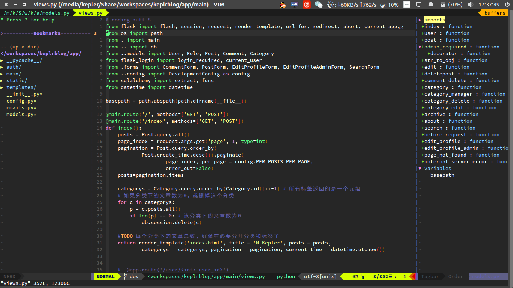

```
 _  __          _                    __     ___
| |/ /___ _ __ | | ___ _ __          \ \   / (_)_ __ __
| ' // _ \ '_ \| |/ _ \ '__|  _____   \ \ / /| | '_ ` _ \ 
| . \  __/ |_) | |  __/ |    |_____|   \ V / | | | | | | |
|_|\_\___| .__/|_|\___|_|               \_/  |_|_| |_| |_|
         |_|
```

## 目录

<!-- vim-markdown-toc Redcarpet -->
* [KeplerVim 简介](#keplervim-简介)
* [安装](#安装)
* [特色和快捷键](#特色和快捷键)
* [Vim 使用备忘](#vim-使用备忘)
* [常用命令](#常用命令)
* [<span id = "note">说明</span>](#说明)

<!-- vim-markdown-toc -->


## KeplerVim 简介





> 我的vim配置是来自[skwp/dotfiles](https://github.com/skwp/dotfiles)的，只是做了自己的个性化更改,
> 去掉了很多不必要的插件   
> 使用的````YCM````编译后的文件,[网盘下载](https://pan.baidu.com/s/1jHOquKe)  
> 这个配置主要用来写````c++/python/java/shell/html5````这些，配置了````F5````一键运行


## 安装
0. 编译安装vim8.0
[博客](http://blog.csdn.net/a464057216/article/details/52821171)
1. 下载本项目
<br/>`git clone https://github.com/M-Kepler/Keplervim.git`

2. 把文件夹放到 Home 目录下, 并改名为`.vim`
```
mv keplervim/ ~/.vim
cd .vim
ln -s ~/.vim/vimrc ~/.vimrc
```

3. 安装插件管理```Vundle```
</br>`git clone https://github.com/gmarik/vundle.git ~/.vim/bundle/vundle`

4. 安装插件  
先去编辑 ```~/.vim/bundles.vim``` 把 ```Plugin 'Valloric/YouCompleteMe'```注释掉, 然后保存退出, 终端输入`vim`, 不管提示的错误，
一直回车进入到界面就行, 输入括号里的内容```:BundleInstall``` 直到所有插件安装正确, 安装出错就再执行一次.  
这些插件安装完后在把 ~/.vim/bundles.vim 里的Plugin 'Valloric/YouCompeteMe' 的注释去掉就可以了

5. 显示md文档的目录结构
> 创建ctags的软链到home目录下
```
ln  -s ~/.vim/ctags ~/.ctags
```


6. ** 注** :
> 1. 由于自己编译YCM太麻烦了，而且不一定能成功，反正我的电脑上没成功.  
   所以下载别人编译后的YCM，然后放到 ~/.vim/bundle/ 下就可以了.  
   如果输入```vim```出错提示与```EOF```相关, 就先把```.vimrc``` 23 到 29 行注释掉, 这几行是为了补全```python```虚拟环境里的库用的
> 2. 想用漂亮的airline的话,去搜索一下就知道了, 需要安装特定的字体, [博客](http://blog.csdn.net/the_victory/article/details/50638810)


## 特色和快捷键


> 我的默认```leader```键为` ; `,你也可以在`.vimrc`里面修改.  

> 表格中空白表示没有使用插件.  

> ** 请注意查看最后面的 [说明](#note). **

| PLUGINS| DESCRIPTION | HOW TO USE |
| :---: | :---: | :---: |
| `NERDTreeToggle` | 目录树 | `<Leader>tn`
| `NERDCommenter` | [快速注释](http://blog.csdn.net/zcube/article/details/42298419) | `<Leader>cc` & `<Leader>cu`
| `Tabular` | [任意对齐](http://blog.longwin.com.tw/2012/02/vim-align-text-plugin-tabular-2012/) | `Tab/=`
| `TagbarToggle` | 代码结构 | `<Leader>tg`
| `YouCompleteMe` | 大名鼎鼎的YCM | |
| `markdown preview` |Markdown实时预览 | `:MarkdownPreview 或 F5`
| `syntastic` | [语法格式检查](#syntastic) | `<Leader>e`
| `snippet` |  自动补全代码块 | `<Leader>Tab`
| `fugitive` | [官网](https://github.com/tpope/vim-fugitive) | |
| `Gundo` | 记录文档修改记录 | `<Leader>u`
| `Ctrlp` | [快速打开文件](http://www.boiajs.com/2014/12/17/vim-ctrlp) | `<Leader>o`
| `Emmet` | [HTML/CSS补全](http://www.iteye.com/news/27580) | `<Leader>h`
| `ack.vim` | [整个工程下全局代码搜索](https://blog.bccn.net/%E9%9D%99%E5%A4%9C%E6%80%9D/13430) | `<Leader>a`
| `dict.vim` | 翻译当前光标下的单词 | `<Leader>fy`
| `tasklist` | `Eclipse`里的`TODO/FIXME/XXX` | `<Leader>tl`
| `vim-devicons` | 目录文件显示图形字符|  |
|  | `python`程序的调试| `Ctrl + d插入断点并进入调试` |
|  | 打开粘贴模式 | `<Leader>p`
|  | `C/C++/JAVA/PYTHON/SHELL` 一键编译 | `F6` |
|  | `C/C++/JAVA/PYTHON/SHELL` 一键运行 | `F5`
|  | 插入作者信息(已注释掉) | `Ctrl+i`
|  | 快速修改`.vimrc` | `<Leader>ev`
|  | 输入 + - / * =  < >可以自动在前后添加空格 | (已注释,vimrc里取消注释后生效)
|  | 括号自动补全 | (已注释,vimrc里取消注释后生效)
|  | 编辑时才发现要`sudo` | `w!!`
|  | 分割窗口的切换 |`<Leader>wh/j/k/l`
|  | 标签页 | `<Leader>x`关闭 / `bn` / `bp`切换


## Vim 使用备忘

| vim command |[vim使用笔记](http://www.cnblogs.com/jiqingwu/archive/2012/06/14/vim_notes.html)|
|:-----:|:----:|
| `gd` | 跳转到局部变量定义处|
| `''`  | (两个单引号) 跳转到上次停靠处
| `:earlier 10m` |  恢复到10分钟以前的状态
| `ge`  | 移动到上一个单词的词未
| `+/-` |  移到下/上一列第一个字符处
| `(/)` |  移到句首/句末
| `{/}` |  段首/段未
| `NG`  |  文件的第n列
| `N+/n-` |  移动光标位置之后/前第N列
| `.`   |  重做
| `:n`  |  跳到第n行
| `:Tx`	|  移动到光标后第一个x处
| `ma`  | |
| `gv`  |  重新选择曾选择过的文本块
| `ctrl + g`|查看当前位置
| `g + ctrl + g` | 统计
| `q:`  | 显示输入过的命令历史
| `vim -M file_name`  | 只读形式打开文件


## 常用命令


* 多行行首插入：   
```
按 Ctrl + v 进入列选择模式，选择需要行首插入的行
然后按 I，进入列插入状态，
输入星号 *，再按下 ESC
你会看到，所有行之前都出现了一个星号
```

* 多行行末插入：   
`Ctrl-v + $ + A + 想插入的字符 + esc`

* [折叠命令](http://www.cnblogs.com/wangkangluo1/archive/2011/06/10/2077203.html)
 * zc 折叠,只折叠最外层的折叠
 * zo 展开,只展开最外层的折叠
 * zC 对所在范围内所有嵌套的折叠点折叠，包括嵌套的折叠.
 * zO 对所在范围内所有嵌套的折叠点展开，包括嵌套折叠.


##  <span id = "note">说明</span>


* 一键编译说明 :
```
C,C++,Fortran,Python,java,Latex,sh等按`<F6>`编译
```

* 一键运行说明 :
```
C,C++,Fortran,Python,java,Latex,sh等按`<F5>`编译运行
其中, python 程序是默认使用系统 python 版本(python2.7)的,
你也可以在对应的地方改为 python3
```

* 关于粘贴说明 :
```
其实，普通文本不打开粘贴，也是可以直接将系统剪切板的内容粘贴到vim编辑器里的，而且格式不会乱
Ctrl + <Leader>就可以选择粘贴系统剪切板的内容了
代码的话还是先打开粘贴模式,在粘贴
```

* <span id = "syntastic">syntastic 说明</span>
```
<Leader>c  close errors windows
<Leader>n  jump to next error
<Leader>p  jump to pre error
```

* vim 调试 python 的说明
[vim和pdb](http://myroot.lofter.com/post/15197d_4ddfaa)
```
用 ipdb 的话把对应的pdb改为ipdb就可以了
```

* 可以查看windows的文本文件，不会显示乱码
